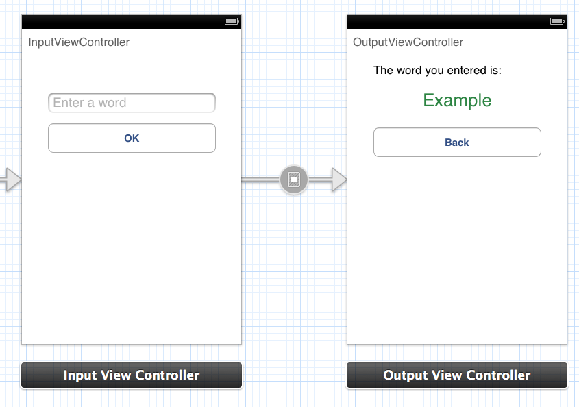

# Programming Exercise for iOS Internship
This repository contains a brief programming exercise using XCode and Objective-C.

## Prerequisites
You will need:

1. An installation of XCode (v4.6.1 or newer)
2. A method of cloning a git repository (e.g. command line git tools - http://stackoverflow.com/questions/9329243/xcode-4-4-command-line-tools)

## Overview
The XCode project contains two view controllers: InputViewController and OutputViewController

Your objectives are to:

1. Clone this github repo to your local disk
2. Open the project in XCode, and make the following enhancements:
	1. when the 'OK' button is pressed on InputViewController, OutputViewController should be displayed
	2. the contents InputViewController's the text field should be displayed in OutputViewController's green label
	3. the 'Back' button should return the user back to the InputViewController

## Completion

Once you have completed the exercise to the best of your ability, you may zip up your code directory and email it to Glenn, or submit a pull request to this repo (https://github.com/gbarnett-cs/iOSChallenge).

